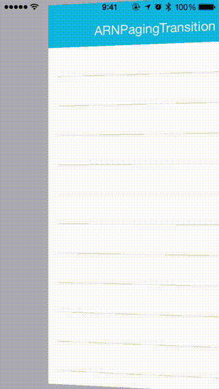
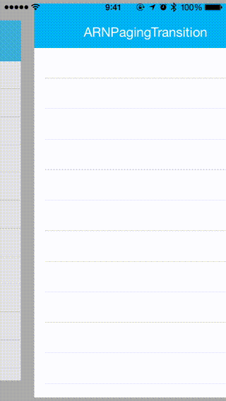

# ARNPagingTransition

It was inspired by the following products.(Respect!)

- [LTSlidingViewController](https://github.com/ltebean/LTSlidingViewController) (objc)

## Usage

To run the example project, clone the repo, and run `pod install` from the Example directory first.

## Requirements

* Xcode 7.0
* iOS 8.0+
* Swift 2.0
* CcoaPods 0.36.0+ (if use CcoaPods)

## Installation

### CocoaPods

ARNPagingTransition is available through [CocoaPods](http://cocoapods.org). To install
it, simply add the following line to your Podfile:

    pod "ARNPagingTransition"

## License

MIT license. See the LICENSE file for more info.
